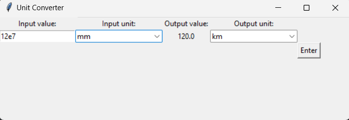

# Unit-Convertor
Unit Convertor is a dashboard application that can convert units for the follwoing parameters length, pressure, and temperature.
##Table of contents
1. [Installation](#installation)
2. [Usage](#usage)
4. [License](#license)
## Installation

1. Clone the repository:
   ```bash
   git clone https://github.com/johnblessmbunga/Unit-Convertor.git
   cd Unit-Convertor
   npm install
## Usage
To strat application ,run:

npm start
### Features
__-Length Conversion__: Can convert length unit from the follwoing set of units mm,cm,m km, and inches.

__-Pressure Conversion__: Can convert pressure unit from the follwoing set of units Pa,kPa,Mpa.

__-Temperature Conversion__: Can convert temperature unit from the follwoing set of units C,F, and K.

__-Dashboard__: contains a dashboard for user input. Initially the dashboard is set to the homepage where the option of conversion can be set to length, pressure or temperature as shown in Figure 1.
### Figure 1: Homepage


When an option is selected user must input necessary units and value which will result in output displayed once the button enter is pressed as shown in Figure 2.
### Figure 2: Input Dashboard Length


__-Error Handling__: Output only produced in event of valid inputs in dashboard.
## License
This project is licensed under MIT license.

### Acknowledgements
Thanks to the os library for providing backend framework.
